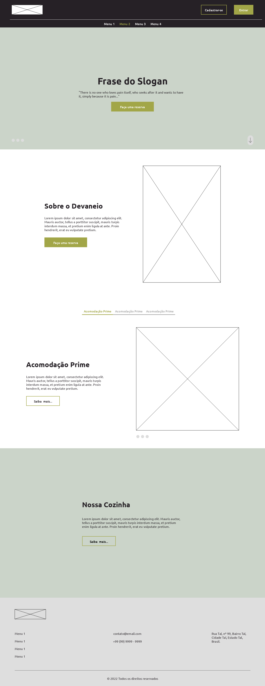

# Projeto Hotel

**_
Status do projeto: :hammer_and_wrench: Em desenvolvimento :hammer_and_wrench:
_**

 

### **Sobre o projeto:**  

Neste projeto o aluno aprenderá a desenvolver um sistema WEB de gerenciamento de um hotel,
com as seguintes funcionalidades:

- Monitoramento do fluxo de hospedes
- Serviços prestados nos apartamentos
- Entrada e saída dos funcionários e seus rodízios de trabalho
- Reservas
- Checkin e checkout

O sistema contempla a lógica pela visão do usuário e do administrador.

#### <b> Layout Proposto </b>

  

#### <b> Layout Atual </b>

  

