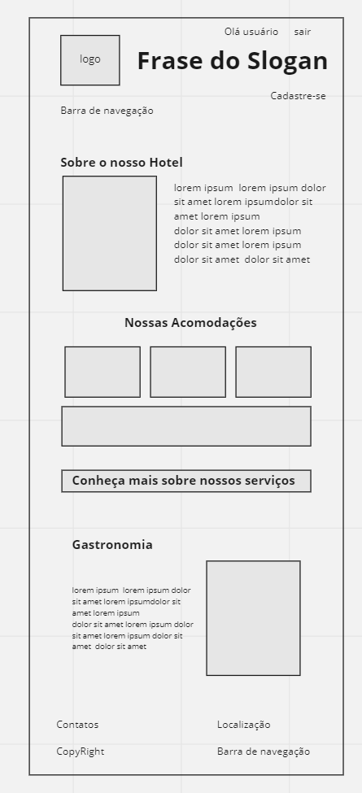

# Projeto Hotel
 
**_
Status do projeto: :hammer_and_wrench: Em desenvolvimento :hammer_and_wrench:
_**
 
 
 
---
 
## **Sobre o projeto:**  
 

Neste projeto o aluno aprenderá a desenvolver um sistema WEB de gerenciamento de um hotel,com as seguintes funcionalidades:

 
- Monitoramento do fluxo de hospedes
- Serviços prestados nos apartamentos
- Entrada e saída dos funcionários e seus rodízios de trabalho
- Reservas
- Checkin e checkout
 

O sistema contempla a lógica pela visão do usuário e do administrador.

 
---
 
 
 
 
### <b> Layout Proposto </b>
 
 
 

 

 
### <b> Layout Atual </b>
 
 
 

 

 
---
 
## Início do Projeto (Front-End):
 
- Criar a estrutura de diretórios
 
- Criar a estrutura DOM utilizando Web Semantic
 
- Separar os blocos header, nav, main e footer
 
- Considerar blocos aside
 
- Escolher a imagem do logo
 Escolher as imagens das acomodações (Pense em 3 tipos.
 
- As páginas devem ser linkadas
 
- A imagem do Logo deve estar em todas as páginas
 Importante!
 
- ### <b> Não aplicar Javascript </b>
 
### <b>Páginas: </b>
 
<b> Área Pública:</b>
 
- Login
- Form
- Home
- O Hotel
- Acomodações com imagens dos quartos
- Reservas
- Form
 Contato
- Form
 Área Administrativa (deve estar numa pasta ‘admin’)
 
<b>Login: </b>
 
- Form
- Home
- Funcionários
- Hóspedes
- Reservas
 
## <b> Refinamento da Estrutura Item 1.1 </b>
 
<b>PÚBLICA</b>
 
- Formulário de Reservas
- Data do checkin - Input Date
- Data do checkout - Input Date
- Quantidade de Adultos - Input Number
- Quantidade de Crianças - Input Number
- Formulário de Contato
- Nome - Input Text
- Email - Input Email
- Telefone - Input Text
- Assunto ( select )
 
- Cancelamento de Reserva
- Ouvidoria
- Departamento Financeiro
- Mensagem - TextArea
 
<b>ADMIN</b>
 
- Funcionários
- Tabela
- Código
- Nome
- Tempo de empresa
- Atividade Atual (select)
 
 - Recepção
 - Restaurante
 - Garagem
 - Serviço de Quarto
 - Gerência
 - Concierge
 - Supervisor de Andar
 - Férias (rádio) Sim | Não
 - Afastamento médico (rádio) Sim | Não
